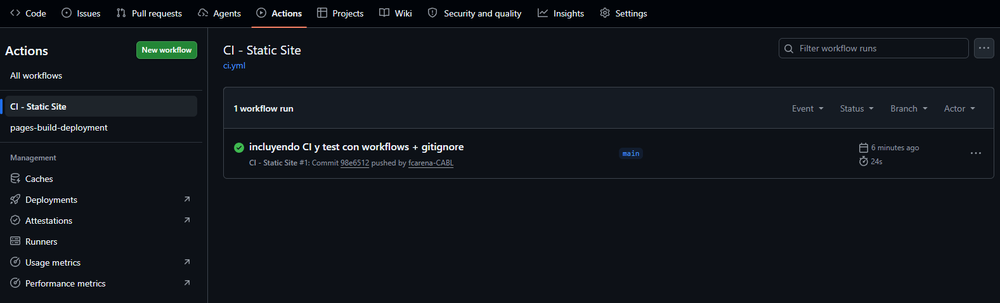
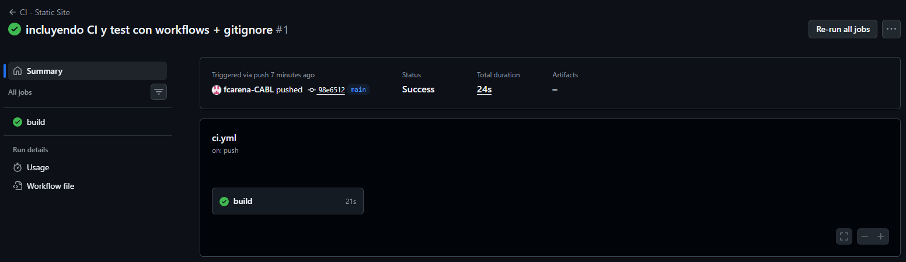
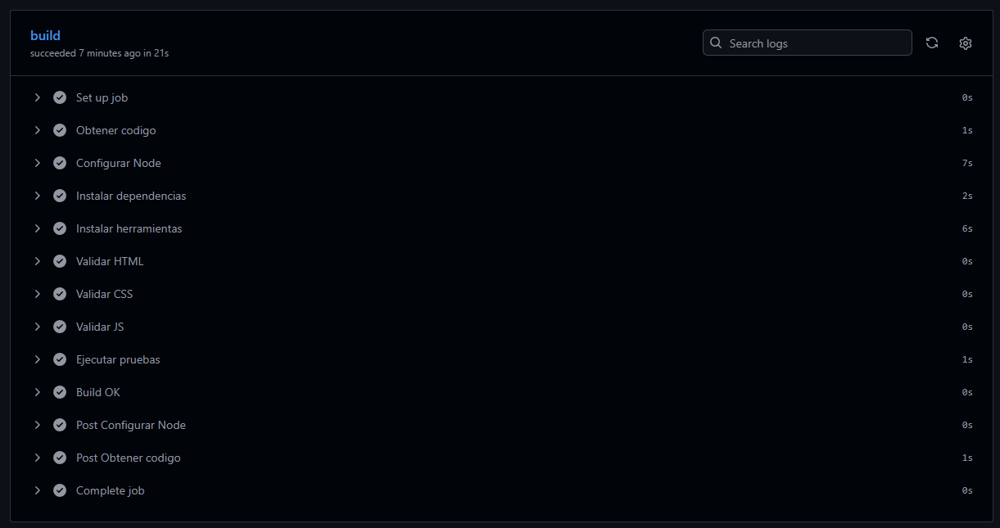

# fcarena-CABL.github.io

# Portafolio Web - GitHub Pages

Este proyecto consiste en la creación de un sitio web estático publicado mediante GitHub Pages.

## 🌐 Sitio web
https://fcarena-cabl.github.io/

## 📌 Descripción

Se desarrolló un portafolio simple en HTML, CSS y JavaScript, con el objetivo de:

## ⚙️ Funcionalidades

- Página principal con listado de actividades
- Menú de navegación entre páginas
- Ingreso de nombre de usuario con mensaje de bienvenida dinámico

## 🛠️ Tecnologías utilizadas

- HTML
- CSS
- JavaScript
- GitHub Pages
- GitHub Codespaces

## 🔄 Workflow de Integración Continua (CI)

Se implementó un workflow utilizando GitHub Actions que se ejecuta automáticamente en cada:

- push a la rama `main`
- pull request hacia `main`

El pipeline realiza las siguientes tareas:

1. Obtiene el código del repositorio
2. Configura el entorno de Node.js
3. Instala dependencias del proyecto
4. Valida el código HTML, CSS y JavaScript
5. Ejecuta pruebas automatizadas con Jest

## 📊 Estado del build

Ejemplos de vistas utilizando GitHub Actions con ejecución autimática:

